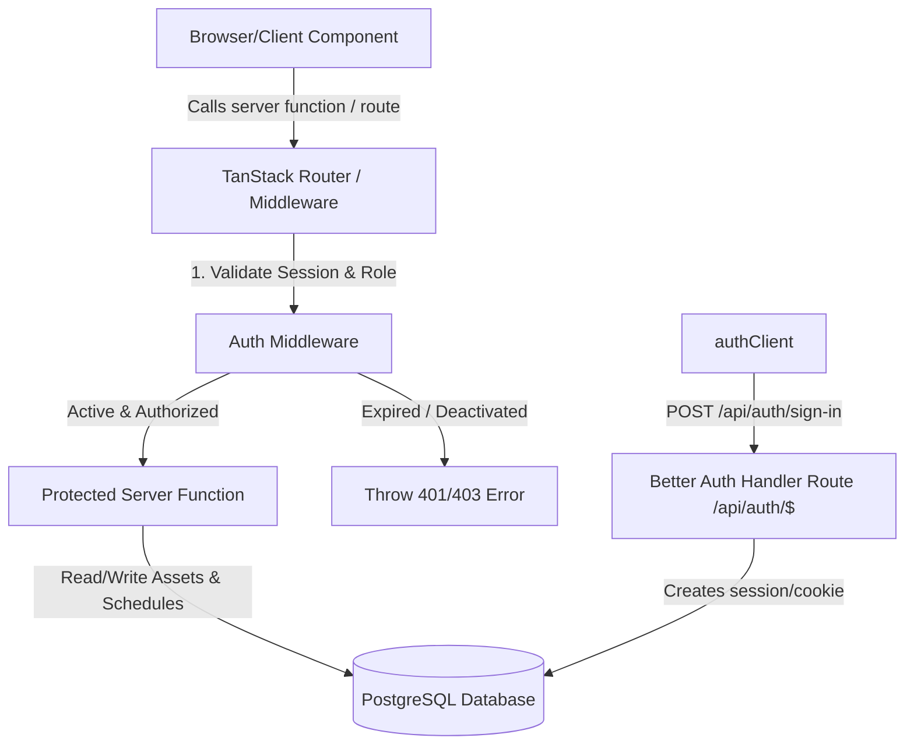

# Phase 2: Secure Administration & Asset Setup - Research

**Researched:** 2026-08-12
**Domain:** Authentication, Session Management, RBAC & Asset Availability Management
**Confidence:** HIGH

<user_constraints>
## User Constraints (from CONTEXT.md)

### Locked Decisions
- **D-01:** Install and configure `better-auth` along with `@better-auth/drizzle-adapter` to manage session state in PostgreSQL database tables — **Reversibility:** one-way.
- **D-02:** Disable public user registration entirely to prevent unauthorized users from creating admin accounts — **Reversibility:** reversible.
- **D-03:** Bridging legacy passwords: Require migrated administrator accounts to perform a password reset flow upon their first sign-in — **Reversibility:** costly.
- **D-04:** Better Auth configuration file must be stored in `src/db/auth.server.ts` to prevent leaks of server environment variables to isomorphic client bundles — **Reversibility:** reversible.
- **D-05:** Enforce authentication and authorization boundaries using TanStack Start middleware (`createMiddleware`) to intercept requests and validate user roles and sessions — **Reversibility:** costly.
- **D-06:** Simple hierarchical role model: `admin` can perform all actions (including deactivating users and managing assets); `operator` can manage assets, schedules, and bookings; `pimpinan` has read-only access — **Reversibility:** reversible.
- **D-07:** Throw standard HTTP 401 (Unauthorized) and 403 (Forbidden) errors at the server function boundary on access failure, allowing TanStack Router's error boundaries or redirects to catch them — **Reversibility:** reversible.
- **D-08:** Sourced user roles from the session object cookie-cached payload instead of re-querying the database on every request to optimize performance — **Reversibility:** reversible.
- **D-09:** Model weekly operating availability schedules in a separate relational table (`asset_availability` referencing the `assets.id` column) — **Reversibility:** costly.
- **D-10:** Model date-specific closures in a separate relational table (`asset_closures` referencing the `assets.id` column) — **Reversibility:** costly.
- **D-11:** Interpret all operating hours and closures in `Asia/Jakarta` local time zone, doing timezone-aware boundary checks on the server — **Reversibility:** costly.
- **D-12:** Asset soft deletion using a status column ('active', 'inactive', 'archived') in the `assets` table, blocking bookings if archived, and retaining all historical booking and audit records — **Reversibility:** reversible.
- **D-13:** Deactivate users by immediately deleting all their session records from the database session table to enforce immediate logouts across all devices — **Reversibility:** reversible.
- **D-14:** Add a status column (`'active'`, `'inactive'`) to the `user` table and verify it in the auth middleware — **Reversibility:** reversible.
- **D-15:** Record account deactivation and session revocation events in the `audit_logs` table — **Reversibility:** reversible.
- **D-16:** Admin users with the `'admin'` role trigger user deactivation through a secure user management UI page calling a protected server function — **Reversibility:** reversible.

### The Agent's Discretion
- The developer agent has discretion over UI styling and dashboard layout using Tailwind CSS.
- The developer agent has discretion over testing setup, Drizzle migration adjustments, and internal file layouts of helper modules.

### Deferred Ideas (OUT OF SCOPE)
- Notifications (email and SMS alerts) — Deferred to Phase 4/5.
- Public calendar booking and availability projection searches — Deferred to Phase 4.
</user_constraints>

<architectural_responsibility_map>
## Architectural Responsibility Map

| Capability | Primary Tier | Secondary Tier | Rationale |
|------------|-------------|----------------|-----------|
| Authentication Handler | Frontend Server | Database/Storage | Mounted as `/api/auth/$` server route to handle Better Auth sessions and credentials. |
| Role-Based Middleware | Frontend Server | — | Enforced via TanStack Start middleware (`createMiddleware`) to validate sessions and verify roles hierarchy at the server boundary. |
| Account Deactivation | Frontend Server | Database/Storage | Admin API which terminates database sessions and marks user status as `'inactive'`. |
| Asset Availability CRUD | Frontend Server | Database/Storage | Authorized administrative server functions modifying `assets`, `asset_availability`, and `asset_closures` tables. |
| Timezone Boundary Validation | Frontend Server | — | Validates that booking ranges map to active operating hours in `Asia/Jakarta` timezone. |
</architectural_responsibility_map>

<research_summary>
## Summary

This research outlines the implementation stack and patterns for securing the administrative boundary of Sarpras PPKASN and setting up asset management. We rely on **Better Auth** with the **Drizzle Adapter** mapped to a PostgreSQL backend. 

To prevent server secret leakage, the Better Auth configuration resides strictly on the server (`src/db/auth.server.ts`), and the client only references the lightweight isomorphic client helper (`src/lib/auth-client.ts`). Route-level protection is enforced via **TanStack Start middleware**, which intercepts server functions, checks active sessions, reads user roles from the session cookies, and throws HTTP 401/403 errors appropriately.

For asset availability, operating hours and closures are split into dedicated relational tables (`asset_availability` and `asset_closures`). Both are validated strictly using timezone-aware logic based on `Asia/Jakarta` to guarantee administrative operations match local business rules. Soft-deletion is modeled using a status field on the assets table, ensuring historical data is preserved.

**Primary recommendation:** Secure all server actions using a centralized `authMiddleware` built with `createMiddleware`, leverage Better Auth's `tanstackStartCookies` plugin for reliable session cookie transfers, and interpret weekly schedules and closures using `date-fns-tz` offset-free boundary checks.
</research_summary>

<standard_stack>
## Standard Stack

### Core
| Library | Version | Purpose | Why Standard |
|---------|---------|---------|--------------|
| better-auth | ^1.2.9 | Authentication Framework | Battle-tested, framework-agnostic TypeScript auth engine. |
| @better-auth/drizzle-adapter | ^1.2.9 | Database Adapter | Connects Better Auth directly to Drizzle tables. |
| @tanstack/react-start | latest | SSR & Server Functions | Core framework hosting server middleware and routes. |
| date-fns-tz | ^3.2.0 | Timezone Calculations | Ensures timezone-aware validation for availability and closures. |

### Supporting
| Library | Version | Purpose | When to Use |
|---------|---------|---------|-------------|
| lucide-react | ^1.31.0 | Icons | Administrative panels and forms. |

**Installation:**
```bash
npm install better-auth @better-auth/drizzle-adapter
```
</standard_stack>

<architecture_patterns>
## Architecture Patterns

### System Architecture Diagram


### Recommended Project Structure
```
src/
├── db/
│   ├── auth.server.ts      # Better Auth Server Config (with Drizzle Adapter)
│   └── schema.ts           # Extended user table & availability tables
├── lib/
│   ├── auth-client.ts      # Isomorphic Better Auth client
│   └── auth.middleware.ts  # TanStack Start Route Middleware
├── routes/
│   ├── api/
│   │   └── auth/
│   │       └── $.ts        # Better Auth catch-all endpoint
│   ├── admin/
│   │   ├── index.tsx       # Admin Dashboard
│   │   ├── users.tsx       # User management (Deactivate / Revoke)
│   │   └── assets.tsx      # Asset Management (CRUD + Availability)
│   └── login.tsx           # Admin Login Page
```

### Pattern 1: Protected Server Middleware
Using TanStack Start middleware to protect endpoints.
```typescript
import { createMiddleware } from "@tanstack/react-start";
import { getRequestHeaders } from "@tanstack/react-start/server";
import { auth } from "@/db/auth.server";

export const authMiddleware = createMiddleware().register({
  before: async ({ next }) => {
    const headers = getRequestHeaders();
    const session = await auth.api.getSession({ headers });

    if (!session || session.user.status === "inactive") {
      throw new Error("Unauthorized");
    }

    return next({
      context: {
        user: session.user,
        session: session.session,
      },
    });
  },
});
```

### Pattern 2: Relational Availability Validation
Validating if a time slot is inside an asset's operating schedule in `Asia/Jakarta` timezone.
```typescript
import { toDate, formatInTimeZone } from "date-fns-tz";

export function checkAvailability(
  targetDate: Date,
  dayOfWeek: number, // 0 = Sunday, 1 = Monday, etc.
  startTime: string, // "08:00"
  endTime: string,   // "16:00"
  weeklySchedules: Array<{ dayOfWeek: number; openTime: string; closeTime: string }>
) {
  const localDay = weeklySchedules.find(s => s.dayOfWeek === dayOfWeek);
  if (!localDay) return false;
  
  return startTime >= localDay.openTime && endTime <= localDay.closeTime;
}
```

### Anti-Patterns to Avoid
- **Isomorphic Auth Configuration:** Do not import `betterAuth` server instance in code-split routes or components. Always keep it in `auth.server.ts`. Importing it on client-side code will crash Vite builds or leak system environment variables.
- **Strict UTC-only checks for Business Hours:** Calculating availability using UTC offsets shifts days across midnight boundaries (WIB is UTC+7). Always perform boundary checks by converting timestamps to their local `Asia/Jakarta` strings first.
- **Hard-Deleting Assets:** Never delete rows from `assets` table if bookings exist. Soft-delete them via `'archived'` status to preserve relational history.
</architecture_patterns>

<dont_hand_roll>
## Don't Hand-Roll

| Problem | Don't Build | Use Instead | Why |
|---------|-------------|-------------|-----|
| Session Persistence | Custom JWTs / Cookies | Better Auth Session Manager | Safe cookie-signing, database session tracking, rotation, and CSRF protection are complex to secure. |
| Password Reset / Hashing | Custom bcrypt / PBKDF2 scripts | Better Auth Credentials Provider | Employs modern hash standards (argon2/scrypt) and pre-built password-verification flows. |
| Timezone Offset Offsets | Hardcoded +/- 7 hour math | `date-fns-tz` | Hardcoded offsets fail to account for DST changes (if any) and raw string parsing errors. |
</dont_hand_roll>

<common_pitfalls>
## Common Pitfalls

### Pitfall 1: Session Leakage through Client Hydration
**What goes wrong:** Loading the Better Auth server configuration directly inside routes causes Vite to include server secrets (database passwords, private keys) in the client bundle.
**Why it happens:** Importing `auth` instead of `authClient` in client-side React routes.
**How to avoid:** Keep `auth` in `.server.ts` files, use TanStack Start server functions to proxy calls, and use `authClient` for direct web SDK interactions.

### Pitfall 2: Local Time Drift in Availability Checks
**What goes wrong:** Checks for "Is asset closed today?" fail because server UTC date is behind/ahead of local Jakarta date.
**Why it happens:** Using `new Date().getDay()` which returns UTC day of the week, mismatching the user's current day in Jakarta.
**How to avoid:** Format dates explicitly with timezone before checking day of the week or date strings:
```typescript
const jakartaDay = Number(formatInTimeZone(new Date(), "Asia/Jakarta", "i")); // 1 (Monday) - 7 (Sunday)
```

### Pitfall 3: Dangling Sessions after User Deactivation
**What goes wrong:** A user is marked `inactive` in the database, but their current session remains cookie-cached and active on the client.
**Why it happens:** Session cookies are checked without validating the user's active status in the database or without destroying database sessions.
**How to avoid:** Immediately delete all records from `session` table for that `userId` upon deactivation, and have the auth middleware check both session existence and `user.status === "active"`.
</common_pitfalls>

<code_examples>
## Code Examples

### 1. Better Auth Server Setup
```typescript
// Source: https://github.com/better-auth/better-auth/blob/main/docs/content/docs/installation.mdx
import { betterAuth } from "better-auth";
import { drizzleAdapter } from "better-auth/adapters/drizzle";
import { tanstackStartCookies } from "better-auth/tanstack-start";
import { db } from "./client.server";
import * as schema from "./schema";

export const auth = betterAuth({
  database: drizzleAdapter(db, {
    provider: "pg",
    schema,
  }),
  plugins: [tanstackStartCookies()],
  user: {
    fields: {
      role: "role",
    },
  },
  signUp: {
    enabled: false, // Disable registration
  },
});
```

### 2. TanStack Start Auth Handler Catch-All Route
```typescript
// Source: https://github.com/better-auth/better-auth/blob/main/docs/content/docs/integrations/tanstack.mdx
import { auth } from "@/db/auth.server";
import { createFileRoute } from "@tanstack/react-router";

export const Route = createFileRoute("/api/auth/$")({
  server: {
    handlers: {
      GET: async ({ request }) => {
        return await auth.handler(request);
      },
      POST: async ({ request }) => {
        return await auth.handler(request);
      },
    },
  },
});
```

### 3. Server Function Authentication Check
```typescript
import { createServerFn } from "@tanstack/react-start";
import { getRequestHeaders } from "@tanstack/react-start/server";
import { auth } from "@/db/auth.server";

export const getAdminProfile = createServerFn({ method: "GET" })
  .middleware([authMiddleware])
  .handler(async ({ context }) => {
    return context.user;
  });
```
</code_examples>

<sota_updates>
## State of the Art (2025-2026)

| Old Approach | Current Approach | When Changed | Impact |
|--------------|------------------|--------------|--------|
| Custom middleware checking cookie tokens and verifying manually | Better Auth `tanstackStartCookies` plugin with built-in handlers | Late 2024 (Better Auth v1) | Native hook into TanStack Start session storage, eliminating hand-rolled cookie parsers. |
| Storing schedules as raw JSON array inside the Asset row | Relational availability and closures tables | Phase 2 context decision | High indexing performance, clean relational queries, and easy SQL constraints. |

**New tools/patterns to consider:**
- **Hierarchical role check middleware:** A middleware factory `requireRole("admin" | "operator")` to clean up server function routing.
- **Audit Logs hooks:** Extending Better Auth hooks to log logins and logouts directly.
</sota_updates>

<open_questions>
## Open Questions

1. **Password reset mechanism for migrated users**
   - What we know: Users migrated from the legacy system need to reset their passwords on first sign-in.
   - What's unclear: How do we track their "first sign-in" status securely without an email sender available (deferred notification)?
   - Recommendation: Add a boolean column `mustResetPassword` on the `user` table, default true for migrated accounts. On sign-in, if this is true, log them in but redirect them to a forced password reset page.
</open_questions>

<sources>
## Sources

### Primary (HIGH confidence)
- `/better-auth/better-auth` - Drizzle Adapter database schema, TanStack Start integration, and client SDK functions.
- `src/db/schema.ts` - Predefined drizzle tables.

### Secondary (MEDIUM confidence)
- TanStack Start official middleware guides for routing access controls.
</sources>

<metadata>
**Research scope:**
- Core technology: Better Auth integration with Drizzle and TanStack Start
- Ecosystem: date-fns-tz, TanStack React Router
- Patterns: Auth Middleware, Soft Delete, Relational Schedule Checks
- Pitfalls: Bundlers secret leakage, timezone daylight offset shifts, orphaned user sessions

**Confidence breakdown:**
- Standard stack: HIGH
- Architecture: HIGH
- Pitfalls: HIGH
- Code examples: HIGH

**Research date:** 2026-08-12
**Valid until:** 2026-09-12
</metadata>

---

*Phase: 02-secure-administration-asset-setup*
*Research completed: 2026-08-12*
*Ready for planning: yes*
