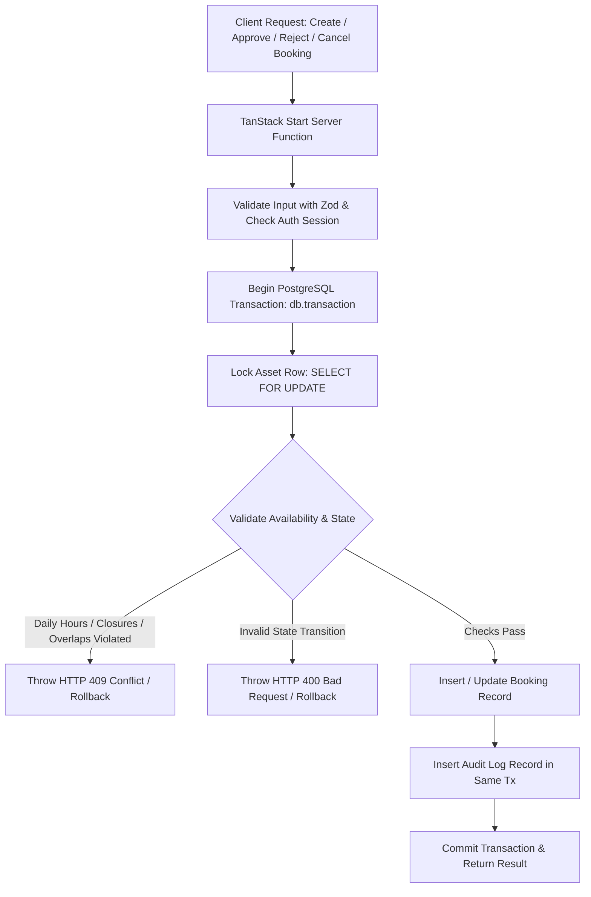

# Phase 3: Booking Integrity & Audit Core - Research

**Researched:** 2026-08-14
**Domain:** PostgreSQL Concurrency Control, State Machines, Timezone Availability Validation, and Audit Logging
**Confidence:** HIGH

<user_constraints>
## User Constraints (from CONTEXT.md)

### Locked Decisions
- **D-01:** Database Row Locking: Use PostgreSQL `SELECT FOR UPDATE` on the asset record inside a transaction to lock the asset before verifying availability and writing the booking. — **Reversibility:** costly
- **D-02:** Failure Handling: Throw an explicit HTTP 409 Conflict error immediately when a lock timeout or availability validation fails. — **Reversibility:** reversible
- **D-03:** Timezone and Date Normalization: Normalize all input dates to UTC timestamps at the database boundary, and interpret them in `Asia/Jakarta` when validating operating hours and closures. — **Reversibility:** costly
- **D-04:** Overlap Blocking Policy: Only block overlapping APPROVED bookings. Multiple pending requests for the same slot are allowed to coexist until one is approved. — **Reversibility:** reversible
- **D-05:** Lifecycle State Machine: Enforce a strict standard lifecycle where `pending` can transition to `approved` or `rejected`, and both `pending`/`approved` can transition to `cancelled`. `rejected` and `cancelled` are terminal states. — **Reversibility:** costly
- **D-06:** Enforce Rejection Reason: Require a non-empty string in the `rejectionReason` column when transitioning a booking's status to `'rejected'`. — **Reversibility:** reversible
- **D-07:** Cancellation Permissions: Allow both the authenticated administrators (via dashboard) and the public requesters (via a non-guessable reference ID) to cancel bookings. — **Reversibility:** costly
- **D-08:** Audit Log Details: Record actor, action, timestamp, and store a diff of the old status vs. the new status inside the audit log metadata for every booking transition. — **Reversibility:** reversible
- **D-09:** Dormitory Shared Capacity: Model dormitory bookings as capacity-based (shared). Multiple bookings can overlap on dates, as long as the sum of guests on any overlapping date does not exceed the dormitory's total capacity. — **Reversibility:** costly
- **D-10:** Room Exclusivity and Capacity: Room bookings are strictly exclusive (one booking at a time) and must have requested attendance less than or equal to the room capacity. — **Reversibility:** costly
- **D-11:** Dormitory Operating Hour Validation: Dormitories skip daily open/close hours (they operate 24/7), but must validate against closures/holidays. Rooms validate against both daily operating hours and closure dates. — **Reversibility:** costly
- **D-12:** Guest Count Representation: Use the existing `attendance` column in the `bookings` table to represent the number of guests/attendees for both room and dormitory bookings. — **Reversibility:** costly

### Developer's Discretion
- The design, utility function naming, and file structures of timezone validation libraries, lock timers, and query helpers under `src/lib/` or `src/db/`.
- Unit and integration test strategies for verifying lock contention and concurrency.

### Deferred Ideas (OUT OF SCOPE)
- SMS/Email notifications for booking submissions or decisions (deferred to v2).
- Administrative queue UI, calendar UI, and dashboard graphs (deferred to Phase 5).
- Public booking request form UI (deferred to Phase 4).

</user_constraints>

<architectural_responsibility_map>
## Architectural Responsibility Map

| Capability | Primary Tier | Secondary Tier | Rationale |
|------------|-------------|----------------|-----------|
| Concurrency & Row Locking | Database/Storage | API/Backend Server | PostgreSQL transaction isolation and `SELECT FOR UPDATE` provide strict serializability on asset-level operations. |
| Timezone Normalization & Closure Validation | API/Backend Server | Database/Storage | Backend validates against `Asia/Jakarta` wall-clock hours and closures before persisting UTC timestamps. |
| Booking Lifecycle State Machine | API/Backend Server | — | Enforces valid transitions (`pending` -> `approved`/`rejected`, `pending`/`approved` -> `cancelled`) before issuing database updates. |
| Dormitory Capacity Summation | Database/Storage | API/Backend Server | Aggregates overlapping approved guest counts via SQL queries inside the locking transaction. |
| Append-Only Audit Logging | Database/Storage | API/Backend Server | Emits immutable audit log records atomically in the same database transaction as the entity mutation. |

</architectural_responsibility_map>

<research_summary>
## Summary

Researched transactional concurrency control, timezone-aware availability calculation, state transition enforcement, and immutable audit trails in PostgreSQL with Drizzle ORM and TanStack Start.

The standard approach pairs PostgreSQL's explicit row-level locking (`SELECT ... FOR UPDATE` via Drizzle's `.for('update')`) with atomic transactions (`db.transaction(async (tx) => { ... })`). This guarantees that concurrent booking approval or creation requests for the same asset are serialized at the database engine level, preventing race conditions and double-bookings.

Date handling is standard across modern TypeScript backends: client inputs are received with timezone metadata or ISO strings, normalized to UTC timestamps for persistence in `timestamptz` columns, and evaluated in the `Asia/Jakarta` (WIB, UTC+7) timezone using `date-fns` and `date-fns-tz` for daily operating hour checks (08:00–16:00) and holiday closure matching.

**Primary recommendation:** Centralize all booking state mutations and integrity validations inside dedicated server-side domain services (`src/lib/booking/` and `src/lib/audit/`), executing every state change and capacity verification inside a locked PostgreSQL transaction.
</research_summary>

<standard_stack>
## Standard Stack

### Core
| Library | Version | Purpose | Why Standard |
|---------|---------|---------|--------------|
| `drizzle-orm` | ^0.45.2 | Database ORM & Query Builder | Type-safe SQL schema, native `db.transaction()` and `.for('update')` row locking for PostgreSQL. |
| `pg` / `@types/pg` | ^8.23.0 | PostgreSQL Node client | Production-grade PostgreSQL connection pooling and transaction support. |
| `date-fns` | ^4.4.0 | Date math & interval logic | Standard modern immutable date library. |
| `date-fns-tz` | ^3.2.0 | Timezone conversions (`Asia/Jakarta`) | IANA timezone parsing (`toZonedTime`, `fromZonedTime`, `formatInTimeZone`). |
| `zod` | ^4.4.3 | Schema validation | Runtime validation for server function inputs and transition payloads. |

### Supporting
| Library | Version | Purpose | When to Use |
|---------|---------|---------|-------------|
| `@tanstack/react-start` | latest | Server Functions (`createServerFn`) | Exposing secure backend RPC endpoints. |
| `better-auth` | ^1.6.27 | Session & RBAC resolution | Identifying actor ID and role for audit logs. |

</standard_stack>

<architecture_patterns>
## Architecture Patterns

### System Architecture Diagram



### Recommended Project Structure
```
src/
├── db/
│   ├── schema.ts                   # Drizzle schema (assets, bookings, auditLogs, availability, closures)
│   ├── client.server.ts            # Drizzle db instance
│   └── migrate.ts                  # Migration runner
└── lib/
    ├── booking/
    │   ├── state-machine.ts        # Booking lifecycle transitions and state guards
    │   ├── availability.ts         # Operating hours, closures, and overlap checks
    │   ├── dormitory.ts            # Dormitory shared capacity calculations
    │   ├── service.server.ts       # Transactional booking operations (create, approve, reject, cancel)
    │   └── types.ts                # Domain types & schemas
    ├── audit/
    │   └── audit.server.ts         # Append-only audit logger helper
    └── timezone/
        └── datetime.ts             # Asia/Jakarta timezone normalization helpers
```

### Pattern 1: Database Row Locking with `FOR UPDATE` in Drizzle Transaction
**What:** Acquire an exclusive lock on the target asset record before reading existing approved bookings or calculating overlapping capacity.
**When to use:** Every booking creation, approval, and rescheduling operation.
**Example:**
```typescript
import { eq } from "drizzle-orm";
import { db } from "#/db/client.server";
import { assets, bookings } from "#/db/schema";

export async function processBookingWithLock(assetId: string, operation: (tx: any, asset: any) => Promise<any>) {
  return await db.transaction(async (tx) => {
    // 1. Lock the asset row
    const [asset] = await tx
      .select()
      .from(assets)
      .where(eq(assets.id, assetId))
      .for("update");

    if (!asset || asset.status !== "active") {
      throw new Error("Asset not found or inactive");
    }

    // 2. Perform availability / capacity validation and booking write
    return await operation(tx, asset);
  });
}
```

### Pattern 2: Asia/Jakarta Timezone & Operating Hours / Closure Validation
**What:** Convert incoming UTC timestamps to `Asia/Jakarta` wall-clock time to verify day-of-week, operating hours (e.g. 08:00-16:00 for rooms), and check against whole-day asset closures.
**When to use:** In `src/lib/booking/availability.ts`.
**Example:**
```typescript
import { toZonedTime, format } from "date-fns-tz";
import { isWithinInterval } from "date-fns";

const TIMEZONE = "Asia/Jakarta";

export function validateOperatingHours(
  startDateUtc: Date,
  endDateUtc: Date,
  availabilityRules: Array<{ dayOfWeek: number; openTime: string; closeTime: string }>
): boolean {
  const startZoned = toZonedTime(startDateUtc, TIMEZONE);
  const endZoned = toZonedTime(endDateUtc, TIMEZONE);

  const startDay = startZoned.getDay();
  const rule = availabilityRules.find((r) => r.dayOfWeek === startDay);
  if (!rule) return false;

  const startTimeStr = format(startZoned, "HH:mm");
  const endTimeStr = format(endZoned, "HH:mm");

  return startTimeStr >= rule.openTime && endTimeStr <= rule.closeTime;
}
```

### Pattern 3: State Machine Transition Guard
**What:** Validate that the transition from `currentStatus` to `nextStatus` is strictly permitted by the state machine before mutating the database.
**When to use:** On all approval, rejection, and cancellation requests.
**Example:**
```typescript
export type BookingStatus = "pending" | "approved" | "rejected" | "cancelled";

const VALID_TRANSITIONS: Record<BookingStatus, BookingStatus[]> = {
  pending: ["approved", "rejected", "cancelled"],
  approved: ["cancelled"],
  rejected: [],
  cancelled: [],
};

export function validateBookingTransition(currentStatus: BookingStatus, nextStatus: BookingStatus, rejectionReason?: string | null) {
  const allowed = VALID_TRANSITIONS[currentStatus];
  if (!allowed || !allowed.includes(nextStatus)) {
    throw new Error(`Invalid booking transition from ${currentStatus} to ${nextStatus}`);
  }
  if (nextStatus === "rejected" && (!rejectionReason || rejectionReason.trim().length === 0)) {
    throw new Error("Rejection reason is required when rejecting a booking");
  }
}
```

### Anti-Patterns to Avoid
- **Checking availability outside the transaction:** Reading bookings without locking the asset creates a race condition where two concurrent transactions see empty slots and both insert bookings.
- **Client-local date assumptions:** Performing day-of-week or hour calculations on the client or in server local time instead of strictly pinning `Asia/Jakarta`.
- **Allowing state transitions without audit trails:** Mutating booking status directly without logging actor, action, timestamp, and status diff.
</architecture_patterns>

<dont_hand_roll>
## Don't Hand-Roll

| Problem | Don't Build | Use Instead | Why |
|---------|-------------|-------------|-----|
| Concurrency Locking | In-memory mutexes or custom lock tables | PostgreSQL `SELECT FOR UPDATE` in Drizzle `db.transaction()` | Multi-instance clustering, crash safety, automatic rollback on failure. |
| Timezone math | Custom UTC offset string manipulation (`+07:00`) | `date-fns` and `date-fns-tz` | Handles leap years, standard date boundaries, and IANA timezone rules reliably. |
| State validation | Ad-hoc if/else checks scattered in endpoints | Centralized state transition map and schema validator | Prevents illegal status jumps (e.g. `rejected` -> `approved`). |

</dont_hand_roll>

<common_pitfalls>
## Common Pitfalls

### Pitfall 1: Timezone Interval Edge Cases
**What goes wrong:** A booking spanning midnight UTC may cross two different calendar days in Jakarta (UTC+7), leading to checking the wrong day's closure or operating hours.
**Why it happens:** Evaluating dates in UTC for local Indonesian office hours.
**How to avoid:** Always convert start and end timestamps to `Asia/Jakarta` zoned dates before checking `dayOfWeek`, `openTime`, `closeTime`, and `closures`.

### Pitfall 2: Double Booking Under High Concurrency
**What goes wrong:** Two users request the same room slot simultaneously; both pass availability checks and both get inserted.
**Why it happens:** Lack of pessimistic row-level locking on the asset row.
**How to avoid:** Always execute `SELECT ... FROM assets WHERE id = ? FOR UPDATE` inside `db.transaction()` before querying conflicting bookings.

### Pitfall 3: Dormitory Capacity Overrun
**What goes wrong:** Multiple dormitory bookings overlap partially in date ranges, and the aggregate guest count exceeds the dormitory's total capacity on peak days.
**Why it happens:** Checking total bookings rather than the day-by-day sum of `attendance` for all overlapping `approved` bookings.
**How to avoid:** Query all approved overlapping bookings for the dormitory and verify that for every day in the requested interval, `sum(attendance) + requested.attendance <= asset.capacity`.

</common_pitfalls>

<code_examples>
## Code Examples

### Transactional Audit Log Writer
```typescript
import { db } from "#/db/client.server";
import { auditLogs } from "#/db/schema";

export interface CreateAuditLogParams {
  actorId: string;
  actorType: "system" | "user";
  action: string;
  entityType: "user" | "asset" | "booking";
  entityId?: string;
  metadata?: Record<string, any>;
}

export async function recordAuditLog(tx: any, params: CreateAuditLogParams) {
  await (tx ?? db).insert(auditLogs).values({
    actorId: params.actorId,
    actorType: params.actorType,
    action: params.action,
    entityType: params.entityType,
    entityId: params.entityId,
    metadata: params.metadata ?? {},
  });
}
```
</code_examples>

<sota_updates>
## State of the Art (2025-2026)

| Old Approach | Current Approach | When Changed | Impact |
|--------------|------------------|--------------|--------|
| Custom lock table / Redis lock | PostgreSQL native `SELECT FOR UPDATE` | Modern DB pattern | Eliminates distributed lock synchronization issues. |
| `moment-timezone` | `date-fns-tz` v3 | 2024+ | Tree-shakeable, immutable, and faster. |
| Manual SQL transactions | Drizzle ORM `db.transaction(async (tx) => { ... })` with `.for('update')` | 2024+ | Fully type-safe transactions and automatic rollback on throw. |
</sota_updates>

<open_questions>
## Open Questions

None. All constraints and domain boundaries are clarified in `03-CONTEXT.md` and locked under decisions D-01 through D-12.
</open_questions>

<sources>
## Sources

### Primary (HIGH confidence)
- Drizzle ORM Documentation (`/drizzle-team/drizzle-orm-docs`) - Transactions, query building, PostgreSQL `.for('update')` row locking.
- PostgreSQL 16 Official Docs - Explicit Locking, `SELECT FOR UPDATE`, Transaction Isolation.
- `date-fns-tz` v3 Documentation - Timezone conversion and zoned date operations.

### Secondary (MEDIUM confidence)
- Sarpras PPKASN Project Context (`03-CONTEXT.md`, `REQUIREMENTS.md`, `ROADMAP.md`, `schema.ts`).
</sources>

<metadata>
## Metadata

**Research scope:**
- PostgreSQL Concurrency & Row Locking in Drizzle ORM
- Timezone validation with `Asia/Jakarta`
- Booking Lifecycle State Machine
- Dormitory capacity aggregation
- Audit trail logging

**Confidence breakdown:**
- Standard stack: HIGH
- Architecture: HIGH
- Pitfalls: HIGH
- Code examples: HIGH

**Research date:** 2026-08-14
**Valid until:** 2026-09-14
</metadata>

---

*Phase: 03-booking-integrity-audit-core*
*Research completed: 2026-08-14*
*Ready for planning: yes*
