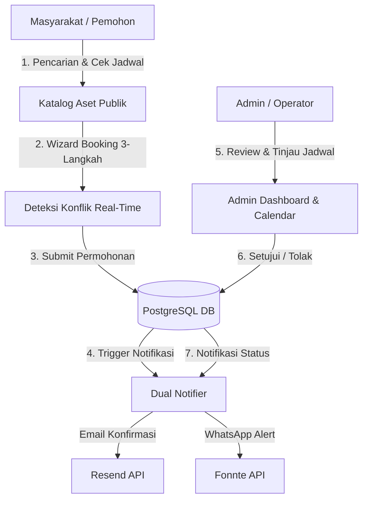

# 🏢 SARPRAS PPKASN - Dokumentasi Sistem Terpadu

Selamat datang di repositori dokumentasi resmi sistem **SARPRAS** (Sistem Informasi Sarana dan Prasarana) Pusat Pelatihan Karakter Terbuka / BKN / PPKASN.

Sistem ini dirancang untuk mendigitalkan dan mengotomatiskan seluruh alur peminjaman fasilitas dan aset (ruang rapat, asrama, auditorium, kendaraan dinas, dll.) secara transparan, akuntabel, dan efisien dengan pencegahan *double-booking* secara *real-time*.

---

## 📚 Daftar Isi Dokumentasi

| Dokumen | Deskripsi |
| :--- | :--- |
| 🏗️ [**Arsitektur Sistem**](./architecture.md) | Gambaran arsitektur sistem, teknologi inti, alur data isomorfik TanStack Start, dan integrasi server. |
| 🗄️ [**Skema Database & ERD**](./database-schema.md) | Struktur tabel PostgreSQL, Drizzle ORM schemas, relasi antar tabel, tipe data, dan strategi migrasi. |
| 🔄 [**Alur Hidup Pemesanan (Booking Lifecycle)**](./booking-lifecycle.md) | Siklus hidup booking 3-tahap, deteksi konflik jadwal (pre-flight & atomic check), pembatalan mandiri, dan state machine. |
| 🔐 [**Autentikasi & RBAC**](./authentication-rbac.md) | Manajemen sesi pengguna via Better Auth, cookie security, RBAC (`admin`, `operator`, `pimpinan`), dan route guards. |
| 🔔 [**Sistem Notifikasi Dual-Channel**](./notifications.md) | Integrasi Resend (Email) & Fonnte (WhatsApp), template otomatis, format zona waktu WIB, dan audit log notifikasi. |
| 🔌 [**Referensi Server Functions & API**](./api-reference.md) | Katalog Server RPC Functions, validasi skema Zod, parameter input, format respons, dan penanganan galat. |
| 🚀 [**Deployment & Operasional**](./deployment-operations.md) | Panduan instalasi Docker, konfigurasi `.env`, migrasi Drizzle, backup database, dan monitoring produksi. |
| 👥 [**Panduan Pengguna (User Guide)**](./user-guide.md) | Buku panduan operasional untuk Pemohon Publik (Masyarakat/Pegawai) dan Administrator Fasilitas. |
| 💻 [**Panduan Pengembang (Developer Guide)**](./developer-guide.md) | Panduan setup lokal, konvensi kode, pengujian unit (`test`), tooling Biome, dan standarisasi commit. |

---

## 🌟 Fitur Utama Sistem



1. **Pencarian Aset & Cek Ketersediaan Real-Time**: Visualisasi kalender ketersediaan aset per tanggal dan jam operasional.
2. **Wizard Booking 3 Langkah**: Pengalaman pemesanan interaktif (Jadwal -> Identitas Pemohon -> Review & Verifikasi).
3. **Pencegahan Double-Booking Kuat**: Validasi bentrok waktu bertingkat pada sisi klien (*optimistic pre-flight*) dan transaksi tingkat database (*database isolation locks*).
4. **Notifikasi Otomatis Dual-Channel**: Notifikasi *multi-cast* instan melalui Email (HTML responsif) dan WhatsApp (OTP / Pesan teks).
5. **Pelacakan Status & Pembatalan Mandiri**: Pemohon dapat melacak status booking via kode referensi unik (`/status/:ref`) serta membatalkan permohonan dengan alasan wajib sebelum diproses.
6. **Panel Admin & Kalender Operasional**: Manajemen aset, tinjauan permohonan dengan drawer interaktif, kalender visual, audit trail lengkap, dan manajemen pengguna.
7. **Keamanan & Audit Trail**: Pencatatan riwayat setiap aksi sistem ke tabel `audit_logs` untuk kepatuhan dan akuntabilitas.

---

## 🛠️ Stack Teknologi

- **Frontend & Fullstack Framework**: React 19, [TanStack Start](https://tanstack.com/start), [TanStack Router](https://tanstack.com/router)
- **Styling**: Tailwind CSS v4, Lucide Icons, Custom Design Tokens
- **Backend & Server Runtime**: Node.js / Bun, TanStack Server Functions
- **Database & ORM**: PostgreSQL 16+, [Drizzle ORM](https://orm.drizzle.team)
- **Autentikasi**: [Better Auth](https://better-auth.com) dengan Drizzle Adapter & HTTP-only cookies
- **Notifikasi**: [Resend](https://resend.com) (Email Transaksional), [Fonnte](https://fonnte.com) (WhatsApp Gateway)
- **Validasi Data**: Zod v4 & TypeScript 5+

---

## ⚡ Memulai Cepat (Quick Start)

```bash
# 1. Clone repositori
git clone https://github.com/tropicans/sarpras.git
cd sarpras

# 2. Salin environment variables
cp .env.example .env

# 3. Jalankan container database & Redis (jika ada)
docker compose up -d postgres

# 4. Install dependensi & jalankan migrasi
pnpm install
pnpm db:migrate
pnpm seed-admin # jika ingin membuat akun superadmin awal

# 5. Jalankan server pengembangan
pnpm dev
```

Aplikasi dapat diakses pada [http://localhost:3000](http://localhost:3000).
