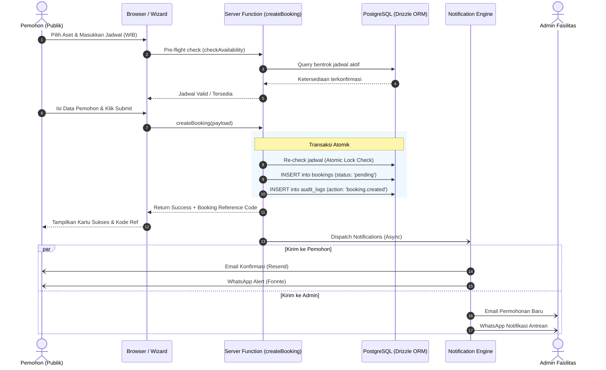

# 🏗️ Arsitektur Sistem SARPRAS

Dokumen ini menjelaskan arsitektur teknis sistem **SARPRAS**, prinsip desain yang diterapkan, aliran data (*data flow*), serta integrasi antar komponen.

---

## 🏛️ Desain Arsitektur Keseluruhan

SARPRAS dibangun menggunakan arsitektur **Fullstack Isomorphic** berbasis **TanStack Start**, yang menyatukan rendering sisi server (SSR), hidrasi cepat sisi klien (SPA), dan fungsi backend (*Server Functions*) dalam satu basis kode bertipe ketat (*End-to-End Type Safety*).

```mermaid
graph TB
    subgraph Klien / Browser
        UI[React 19 UI / TanStack Router]
        Store[Zustand / Local State / Forms]
    end

    subgraph Edge & Server Layer
        SSR[TanStack Start SSR Engine]
        Middleware[Auth & RBAC Middleware]
        ServerFn[TanStack Server Functions (RPC)]
    end

    subgraph Core Domain & Services
        BookingSvc[Booking Service & Concurrency Guard]
        AuditSvc[Audit Trail Logger]
        NotifEngine[Unified Notification Orchestrator]
    end

    subgraph Data & External Services
        DB[(PostgreSQL 16 Database)]
        ResendAPI[Resend Email API]
        FonnteAPI[Fonnte WhatsApp API]
    end

    UI <-->|Hydration & Client Navigation| SSR
    UI -->|Type-safe RPC Call| ServerFn
    ServerFn --> Middleware
    Middleware --> BookingSvc
    BookingSvc -->|Drizzle ORM Query & Tx| DB
    BookingSvc --> AuditSvc
    AuditSvc --> DB
    BookingSvc --> NotifEngine
    NotifEngine -.->|Asynchronous Dispatch| ResendAPI
    NotifEngine -.->|Asynchronous Dispatch| FonnteAPI
```

---

## 🧩 Komponen Utama

### 1. Lapisan Antarmuka (Presentation Layer)
- **TanStack Router**: Pengarah rute (*file-based routing*) dengan kemampuan *loaders*, *pre-fetching*, dan *search params validation*.
- **Tailwind CSS v4 & Lucide Icons**: Sistem desain terstandar untuk antarmuka publik dan dasbor administrator dengan dukungan tema terang/gelap.
- **Form Validation**: Menggunakan Zod untuk memastikan semua masukan pengguna tervalidasi pada klien sebelum dikirim ke server.

### 2. Lapisan Server & RPC (Server Layer)
- **TanStack Server Functions (`createServerFn`)**: Menggantikan REST API konvensional dengan RPC yang otomatis menginferensi tipe data TypeScript dari server ke klien tanpa *code generator* tambahan.
- **Autentikasi & Middleware**: Validasi sesi berbasis cookie terenkripsi (`HttpOnly`, `SameSite=Lax`) menggunakan **Better Auth** dan Drizzle ORM Adapter.

### 3. Lapisan Bisnis & Transaksi (Business Domain Layer)
- **Pencegahan Bentrok Jadwal (*Conflict Resolver*)**: Mengevaluasi irisan rentang waktu (`[startDate, endDate]`) terhadap pemesanan berstatus `approved` atau `pending` aktif.
- **Transaksi Basis Data Atomik**: Memanfaatkan `db.transaction()` pada Drizzle ORM untuk menjamin konsistensi data saat pembuatan, persetujuan, atau pembatalan pemesanan.
- **Audit Trail Engine**: Mencatat setiap aktivitas penting ke dalam tabel `audit_logs` dengan payload JSON perubahan data (*before vs after diff*).

### 4. Lapisan Notifikasi (Notification Layer)
- **Dual-Channel Dispatcher**: Mengirimkan notifikasi ke pemohon dan administrator secara paralel melalui dua jalur:
  - **Email (Resend)**: Template HTML responsif dengan tombol CTA (*Call to Action*).
  - **WhatsApp (Fonnte)**: Pesan teks terstruktur dengan ringkasan status dan link pelacakan langsung.
- **Failsafe & Error Isolation**: Kegagalan pada penyedia notifikasi pihak ketiga tidak akan menggagalkan transaksi database pemesanan (*non-blocking resilience*).

---

## 🔄 Alur Data Permohonan Peminjaman (Sequence Diagram)

Diagram berikut menggambarkan alur interaksi saat seorang pengguna mengajukan peminjaman fasilitas:



---

## 🔒 Prinsip Keamanan & Ketahanan Sistem

1. **Strict Input Sanitization**: Semua input string, tanggal, dan email dibersihkan dan divalidasi dengan Zod schema sebelum menyentuh lapisan database.
2. **Timezone Uniformity**: Seluruh waktu disimpan dalam format UTC (`timestamptz`) di database dan dikonversi ke `Asia/Jakarta` (WIB) saat ditampilkan dan diformat dalam notifikasi.
3. **Session Cookie Security**: Cookie sesi dikonfigurasi dengan flag `HttpOnly`, `Secure` (pada HTTPS), dan `SameSite=Lax`.
4. **Resilient Third-Party Outages**: Pengiriman email/WhatsApp dibungkus dalam `try/catch` dengan pencatatan log mandiri ke `audit_logs` sehingga sistem tetap berjalan normal meskipun gateway eksternal sedang *down*.
