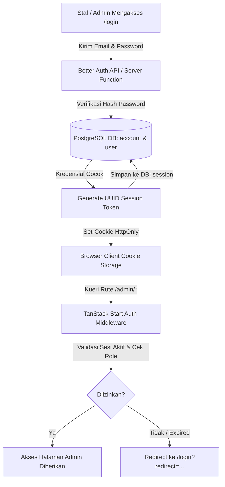

# 🔐 Autentikasi & Kontrol Akses Berbasis Peran (RBAC)

Dokumen ini menjelaskan arsitektur autentikasi menggunakan **Better Auth**, manajemen sesi pengguna, matriks hak akses (*Role-Based Access Control / RBAC*), dan proteksi rute admin pada sistem SARPRAS.

---

## 🏛️ Arsitektur Autentikasi (Better Auth)

SARPRAS menggunakan **Better Auth** dengan adapter database Drizzle ORM PostgreSQL untuk mengelola siklus hidup kredensial, token sesi, dan cookie.



### Keamanan Cookie Sesi:
- **`HttpOnly`**: Mencegah script berbahaya (XSS) membaca token sesi.
- **`SameSite=Lax`**: Melindungi sistem dari serangan pemalsuan permintaan lintas situs (CSRF).
- **`Secure`**: Mengaktifkan transmisi cookie terenkripsi hanya melalui protokol HTTPS di lingkungan produksi.

---

## 🎭 Peran Pengguna (User Roles) & Matriks Hak Akses (RBAC)

Sistem membedakan tiga level otorisasi internal staf:

1. **`admin` (Super Admin)**: Memiliki kendali penuh atas seluruh fasilitas, konfigurasi sistem, audit log, dan penambahan/penghapusan akun staf.
2. **`operator` (Pengelola Sarana Prasarana)**: Bertugas mengelola katalog aset harian, meninjau permohonan booking, menyetujui, atau menolak peminjaman.
3. **`pimpinan` (Manajemen / Pengambil Keputusan)**: Memiliki hak peninjauan kalender, laporan statistik pemakaian aset, persetujuan khusus, serta audit trail tanpa hak merusak data aset.

### 📋 Matriks Hak Akses (Permissions Matrix)

| Modul & Tindakan | Publik (Tamu) | Operator | Pimpinan | Admin |
| :--- | :---: | :---: | :---: | :---: |
| **Katalog Aset (Lihat / Cek Jadwal)** | ✅ | ✅ | ✅ | ✅ |
| **Ajukan Booking Baru** | ✅ | ✅ | ✅ | ✅ |
| **Cek Status & Pembatalan Mandiri** | ✅ | ✅ | ✅ | ✅ |
| **Akses Dasbor Admin (`/admin`)** | ❌ | ✅ | ✅ | ✅ |
| **Tinjau Antrean Permohonan (`/admin/bookings`)** | ❌ | ✅ | ✅ | ✅ |
| **Setujui / Tolak Permohonan Booking** | ❌ | ✅ | ✅ | ✅ |
| **Akses Kalender Operasional (`/admin/calendar`)** | ❌ | ✅ | ✅ | ✅ |
| **Tambah / Edit Fasilitas (`/admin/assets`)** | ❌ | ✅ | ❌ | ✅ |
| **Hapus / Arsipkan Fasilitas** | ❌ | ❌ | ❌ | ✅ |
| **Manajemen Akun Staf (`/admin/users`)** | ❌ | ❌ | ❌ | ✅ |
| **Lihat Log Audit Sistem (`/admin/audit`)** | ❌ | ❌ | ✅ | ✅ |

---

## 🛡️ Proteksi Rute Sisi Server (Route Guards & Middleware)

Proteksi rute diimplementasikan secara terpusat pada *layout route* `src/routes/admin.tsx` dan modul middleware `src/lib/auth.middleware.ts` menggunakan TanStack Router `beforeLoad`:

```typescript
// Contoh Penerapan Guard pada src/routes/admin.tsx
export const Route = createFileRoute('/admin')({
  beforeLoad: async ({ context, location }) => {
    const session = await getSessionContext();
    
    // Jika tidak ada sesi aktif, lempar redirect ke login
    if (!session || !session.user) {
      throw redirect({
        to: '/login',
        search: { redirect: location.href },
      });
    }

    // Periksa status akun aktif
    if (session.user.status !== 'active') {
      throw redirect({
        to: '/login',
        search: { error: 'ACCOUNT_INACTIVE' },
      });
    }

    return { user: session.user };
  },
});
```

---

## 🔄 Kebijakan Reset Password Wajib (`mustResetPassword`)

Untuk akun baru yang dibuatkan oleh Super Admin atau akun hasil migrasi database lama:
1. Kolom `must_reset_password` pada tabel `user` diset menjadi `true`.
2. Saat staf berhasil login pertama kali, middleware akan mengarahkan pengguna ke halaman penggantian password wajib sebelum dapat mengakses fitur operasional lainnya.
3. Setelah password berhasil diperbarui, flag `must_reset_password` otomatis diubah menjadi `false`.
