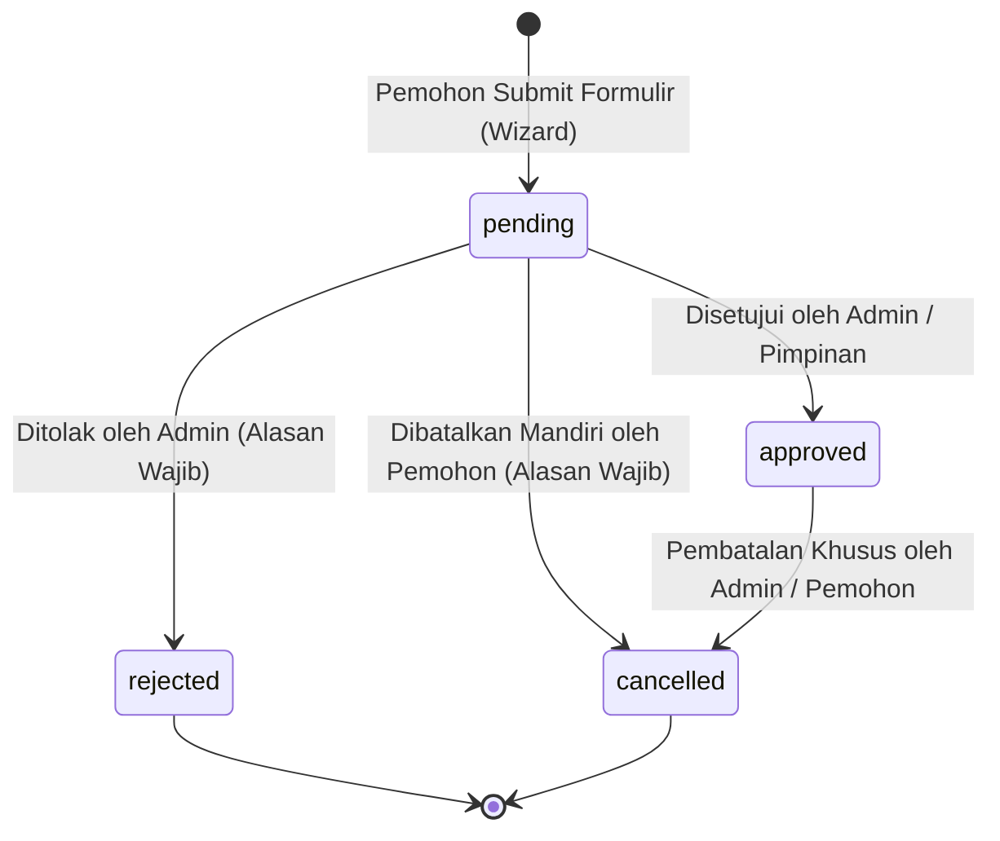
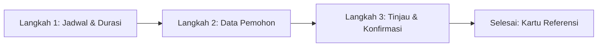

# 🔄 Alur Hidup Pemesanan (Booking Lifecycle)

Dokumen ini menjelaskan siklus hidup lengkap pemesanan aset (*booking lifecycle*), mekanisme pencegahan bentrok (*double-booking prevention*), alur persetujuan admin, serta fitur pembatalan mandiri oleh pemohon.

---

## 🧭 Diagram Status & Transisi (State Machine)

Status peminjaman dikelola secara ketat melalui mesin status (*finite state machine*) berikut:



### Penjelasan Status:
1. **`pending` (Menunggu Tinjauan)**: Permohonan telah berhasil dibuat oleh pemohon dan masuk ke antrean persetujuan admin. Waktu fasilitas telah diproteksi dari pengajuan lain yang bertabrakan.
2. **`approved` (Disetujui)**: Permohonan telah diverifikasi dan disetujui oleh admin/operator. Jadwal fasilitas resmi terkunci.
3. **`rejected` (Ditolak)**: Permohonan ditolak oleh admin dengan menyertakan alasan tertulis (misal: perawatan darurat atau prioritas pimpinan). Fasilitas kembali terbuka untuk tanggal tersebut.
4. **`cancelled` (Dibatalkan)**: Permohonan dibatalkan baik secara mandiri oleh pemohon melalui halaman pelacakan publik maupun oleh admin operasional.

---

## 🛡️ Mekanisme Pencegahan Double-Booking (Concurrency Control)

Sistem menerapkan validasi dua lapis (*two-tier defense*) untuk menjamin tidak ada dua peminjam yang menggunakan satu ruangan pada rentang waktu yang saling beririsan:

### 1. Lapisan 1: Pre-Flight Availability Check (Client-Side Feedback)
Saat pemohon memilih tanggal dan jam pada Langkah 1 Wizard, antarmuka memanggil fungsi `checkAvailability`. Sistem memeriksa apakah terdapat jadwal lain dengan kriteria bentrok:

$$\text{Overlap} \iff (\text{start}_{\text{new}} < \text{end}_{\text{existing}}) \land (\text{end}_{\text{new}} > \text{start}_{\text{existing}})$$

Dan status booking yang ada berstatus `pending` atau `approved`.

### 2. Lapisan 2: Atomic Transactional Guard (Server Execution)
Saat tombol **Submit Permohonan** diklik, operasi dijalankan di dalam blok transaksi PostgreSQL `db.transaction()`:
1. Sistem mengeksekusi *pencarian bentrok ulang* dengan query Drizzle ORM terkunci.
2. Jika ditemukan bentrok (karena ada pemohon lain yang submit beberapa milidetik lebih cepat), transaksi dibatalkan (*rollback*) dan melempar galat `ConflictError (409)`.
3. Jika aman, baris baru dimasukkan ke tabel `bookings` dan riwayat dicatat di `audit_logs`.

```typescript
// Logika Inti Deteksi Bentrok (Booking Conflict Query)
const conflict = await tx.query.bookings.findFirst({
  where: and(
    eq(bookings.assetId, assetId),
    inArray(bookings.status, ['pending', 'approved']),
    lt(bookings.startDate, newEndDate),
    gt(bookings.endDate, newStartDate)
  )
});

if (conflict) {
  throw new Error("WAKTU_BENTROK: Fasilitas telah dipesan pada rentang waktu tersebut.");
}
```

---

## 📝 3-Step Wizard Alur Peminjaman Publik

Pengajuan peminjaman di sisi pemohon dirancang melalui 3 langkah terpandu:



### Langkah 1: Pemilihan Jadwal (`ScheduleStep`)
- Pemohon menentukan **Tanggal Mulai**, **Jam Mulai**, **Tanggal Selesai**, dan **Jam Selesai** (dalam format WIB).
- Dilengkapi indikator ketersediaan instan serta visualisasi jadwal yang telah terisi.

### Langkah 2: Identitas & Keperluan (`RequesterStep`)
- Pengisian data: **Nama Lengkap**, **Email Dinas/Aktif**, **Nomor WhatsApp**, **Unit Kerja / Instansi**, **Tujuan Pemakaian**, dan **Estimasi Jumlah Peserta**.
- Format nomor WhatsApp otomatis dinormalisasi ke standar internasional (contoh: `0812...` menjadi `62812...`).

### Langkah 3: Tinjauan & Verifikasi (`ReviewStep`)
- Pemohon meninjau kembali ringkasan aset, total jam peminjaman, rincian kontak, dan pakta integritas pemakaian fasilitas.

### Selesai: Konfirmasi & Kode Referensi (`SuccessCard`)
- Menampilkan **Kode Referensi Pemesanan** (UUID) yang dapat disalin.
- Memberikan tautan langsung ke halaman pelacakan status (`/status/:ref`).

---

## 🔍 Pelacakan Status & Pembatalan Mandiri

Pemohon dapat memantau status peminjaman kapan saja melalui halaman `/status/$ref` atau menu **Cek Booking** (`/check-booking`):

1. **Informasi Real-Time**: Status terkini (`pending`, `approved`, `rejected`, `cancelled`) ditampilkan dengan lencana visual yang jelas.
2. **Detail Penolakan**: Jika permohonan ditolak, kotak peringatan khusus menampilkan alasan resmi dari admin.
3. **Pembatalan Mandiri (Self-Service Cancellation)**:
   - Pemohon yang berubah rencana dapat membatalkan booking yang masih berstatus `pending` atau `approved`.
   - **Alasan pembatalan wajib diisi** sebelum tombol konfirmasi aktif untuk keperluan akuntabilitas data.
   - Pembatalan otomatis membebaskan jadwal aset dan mengirimkan notifikasi ke admin serta pemohon.
