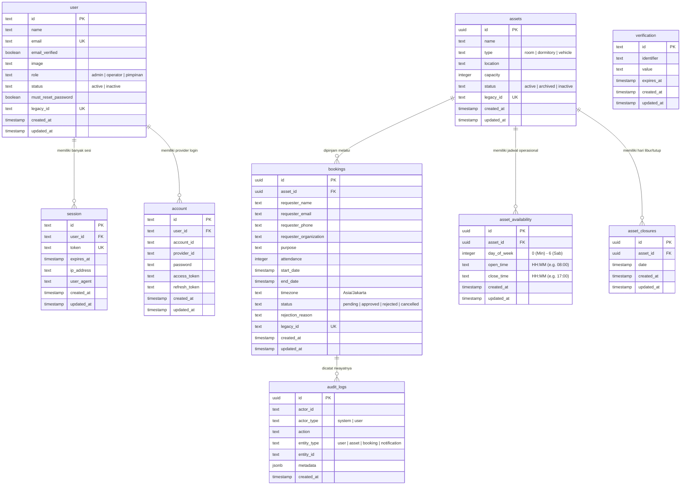

# 🗄️ Skema Basis Data & ERD

Dokumen ini memuat dokumentasi menyeluruh mengenai skema basis data PostgreSQL yang dikelola menggunakan **Drizzle ORM** pada sistem SARPRAS.

---

## 📊 Entity Relationship Diagram (ERD)



---

## 📑 Rincian Tabel Basis Data

### 1. `user` (Tabel Pengguna & Staf)
Menyimpan data akun administrator, operator, dan pimpinan untuk akses panel kelola.

| Kolom | Tipe Data | Constraint | Nilai Bawaan | Keterangan |
| :--- | :--- | :--- | :--- | :--- |
| `id` | `text` | **PK** | `crypto.randomUUID()` | ID Unik Pengguna |
| `name` | `text` | NOT NULL | - | Nama lengkap staf/admin |
| `email` | `text` | NOT NULL, UNIQUE | - | Alamat email dinas |
| `email_verified`| `boolean` | NOT NULL | `false` | Status verifikasi email |
| `image` | `text` | NULL | - | URL foto avatar |
| `role` | `text` | NOT NULL | `'operator'` | Role akses: `admin`, `operator`, `pimpinan` |
| `status` | `text` | NOT NULL | `'active'` | Status akun: `active`, `inactive` |
| `must_reset_password`| `boolean`| NOT NULL | `false` | Wajib ganti password saat login |
| `legacy_id` | `text` | UNIQUE, NULL | - | ID referensi dari database lama |
| `created_at` | `timestamptz` | NOT NULL | `now()` | Waktu pembuatan akun |
| `updated_at` | `timestamptz` | NOT NULL | `now()` | Waktu pembaruan akun |

---

### 2. `session` (Tabel Sesi Pengguna)
Dikelola otomatis oleh Better Auth untuk mencatat token autentikasi berbasis sesi aktif.

| Kolom | Tipe Data | Constraint | Keterangan |
| :--- | :--- | :--- | :--- |
| `id` | `text` | **PK** | ID Sesi |
| `user_id` | `text` | **FK** -> `user.id` (CASCADE) | Referensi ke pengguna pemilik sesi |
| `token` | `text` | NOT NULL, UNIQUE | Token sesi terenkripsi |
| `expires_at` | `timestamptz` | NOT NULL | Waktu kedaluwarsa sesi |
| `ip_address` | `text` | NULL | Alamat IP saat login |
| `user_agent` | `text` | NULL | Perangkat & browser pengguna |
| `created_at` | `timestamptz` | NOT NULL | Waktu inisiasi sesi |
| `updated_at` | `timestamptz` | NOT NULL | Waktu pembaruan sesi |

---

### 3. `account` (Tabel Kredensial Autentikasi)
Menyimpan hash password (argon2/bcrypt) atau kredensial OAuth provider.

| Kolom | Tipe Data | Constraint | Keterangan |
| :--- | :--- | :--- | :--- |
| `id` | `text` | **PK** | ID Akun Kredensial |
| `user_id` | `text` | **FK** -> `user.id` (CASCADE) | Referensi ke tabel `user` |
| `account_id` | `text` | NOT NULL | ID akun eksternal / email |
| `provider_id` | `text` | NOT NULL | e.g. `'credential'`, `'google'` |
| `password` | `text` | NULL | Hash password aman |
| `created_at` | `timestamptz` | NOT NULL | Waktu dibuat |
| `updated_at` | `timestamptz` | NOT NULL | Waktu diperbarui |

---

### 4. `assets` (Tabel Fasilitas & Sarana Prasarana)
Katalog utama ruang rapat, asrama, auditorium, atau fasilitas yang dapat dipinjam.

| Kolom | Tipe Data | Constraint | Nilai Bawaan | Keterangan |
| :--- | :--- | :--- | :--- | :--- |
| `id` | `uuid` | **PK** | `gen_random_uuid()` | ID Unik Aset |
| `name` | `text` | NOT NULL | - | Nama aset/ruangan (e.g. *Auditorium Graha 1*) |
| `type` | `text` | NOT NULL | - | Kategori aset (`room`, `dormitory`, dll.) |
| `location` | `text` | NULL | - | Lokasi gedung/lantai |
| `capacity` | `integer` | NOT NULL | - | Kapasitas daya tampung (orang) |
| `status` | `text` | NOT NULL | `'active'` | Status aset (`active`, `archived`, `inactive`) |
| `legacy_id` | `text` | UNIQUE, NULL | - | ID referensi data migrasi lama |
| `created_at` | `timestamptz` | NOT NULL | `now()` | Waktu didaftarkan |
| `updated_at` | `timestamptz` | NOT NULL | `now()` | Waktu pembaruan informasi |

---

### 5. `bookings` (Tabel Pemesanan & Peminjaman)
Inti transaksi peminjaman sarana dan prasarana.

| Kolom | Tipe Data | Constraint | Nilai Bawaan | Keterangan |
| :--- | :--- | :--- | :--- | :--- |
| `id` | `uuid` | **PK** | `gen_random_uuid()` | ID Pemesanan (sekaligus referensi pelacakan) |
| `asset_id` | `uuid` | **FK** -> `assets.id` (RESTRICT) | Fasilitas yang dipinjam |
| `requester_name` | `text` | NOT NULL | - | Nama lengkap pemohon |
| `requester_email` | `text` | NOT NULL | - | Alamat email pemohon |
| `requester_phone` | `text` | NULL | - | Nomor WhatsApp / telepon aktif pemohon |
| `requester_organization` | `text` | NULL | - | Instansi / Unit Kerja / Biro pemohon |
| `purpose` | `text` | NULL | - | Tujuan & agenda kegiatan peminjaman |
| `attendance` | `integer` | NULL | - | Estimasi jumlah peserta hadir |
| `start_date` | `timestamptz` | NOT NULL | - | Waktu mulai peminjaman (UTC) |
| `end_date` | `timestamptz` | NOT NULL | - | Waktu selesai peminjaman (UTC) |
| `timezone` | `text` | NOT NULL | `'Asia/Jakarta'` | Basis zona waktu input |
| `status` | `text` | NOT NULL | `'pending'` | Status: `pending`, `approved`, `rejected`, `cancelled` |
| `rejection_reason` | `text` | NULL | - | Alasan penolakan admin / alasan pembatalan pemohon |
| `legacy_id` | `text` | UNIQUE, NULL | - | ID referensi sistem lama |
| `created_at` | `timestamptz` | NOT NULL | `now()` | Waktu pengajuan formulir |
| `updated_at` | `timestamptz` | NOT NULL | `now()` | Waktu perubahan status |

---

### 6. `asset_availability` (Jadwal Operasional Aset)
Menentukan rentang jam buka-tutup fasilitas berdasarkan hari dalam seminggu.

| Kolom | Tipe Data | Constraint | Keterangan |
| :--- | :--- | :--- | :--- |
| `id` | `uuid` | **PK** | ID Jadwal Operasional |
| `asset_id` | `uuid` | **FK** -> `assets.id` (CASCADE) | Relasi ke aset |
| `day_of_week` | `integer` | NOT NULL | Indeks hari: `0` (Minggu) s.d. `6` (Sabtu) |
| `open_time` | `text` | NOT NULL | Jam buka (format `"HH:MM"`, e.g. `"08:00"`) |
| `close_time` | `text` | NOT NULL | Jam tutup (format `"HH:MM"`, e.g. `"17:00"`) |
| `created_at` | `timestamptz` | NOT NULL | Waktu dicatat |
| `updated_at` | `timestamptz` | NOT NULL | Waktu diperbarui |

---

### 7. `asset_closures` (Hari Libur / Pemeliharaan Aset)
Mencatat tanggal-tanggal khusus di mana aset ditutup (maintenance, renovasi, hari libur nasional).

| Kolom | Tipe Data | Constraint | Keterangan |
| :--- | :--- | :--- | :--- |
| `id` | `uuid` | **PK** | ID Penutupan Aset |
| `asset_id` | `uuid` | **FK** -> `assets.id` (CASCADE) | Relasi ke aset |
| `date` | `timestamptz` | NOT NULL | Tanggal penutupan/libur fasilitas |
| `created_at` | `timestamptz` | NOT NULL | Waktu dibuat |
| `updated_at` | `timestamptz` | NOT NULL | Waktu diperbarui |

---

### 8. `audit_logs` (Rekam Jejak Audit & Kepatuhan)
Menyimpan riwayat mutasi data penting untuk akuntabilitas operasional.

| Kolom | Tipe Data | Constraint | Keterangan |
| :--- | :--- | :--- | :--- |
| `id` | `uuid` | **PK** | ID Rekam Audit |
| `actor_id` | `text` | NOT NULL | ID Pengguna atau `'system'` / `'public_requester'` |
| `actor_type` | `text` | NOT NULL | `'user'` atau `'system'` |
| `action` | `text` | NOT NULL | e.g. `'booking.create'`, `'booking.approve'`, `'booking.reject'`, `'booking.cancel'` |
| `entity_type` | `text` | NOT NULL | `'booking'`, `'asset'`, `'user'`, `'notification'` |
| `entity_id` | `text` | NULL | ID entitas yang mengalami perubahan |
| `metadata` | `jsonb` | NULL | Detail perubahan nilai, alasan penolakan, response API notifikasi, dll. |
| `created_at` | `timestamptz` | NOT NULL | Waktu pencatatan mutasi |

---

## 🛠️ Manajemen Migrasi dengan Drizzle ORM

Skema database didefinisikan secara deklaratif di `src/db/schema.ts`. Perintah berikut digunakan untuk mengelola migrasi:

```bash
# 1. Menghasilkan file migrasi SQL baru dari perubahan skema TS
pnpm db:generate

# 2. Menerapkan migrasi ke database target
pnpm db:migrate

# 3. Migrasi data dari database legacy/lama (jika ada data historis)
pnpm db:migrate-legacy
```
