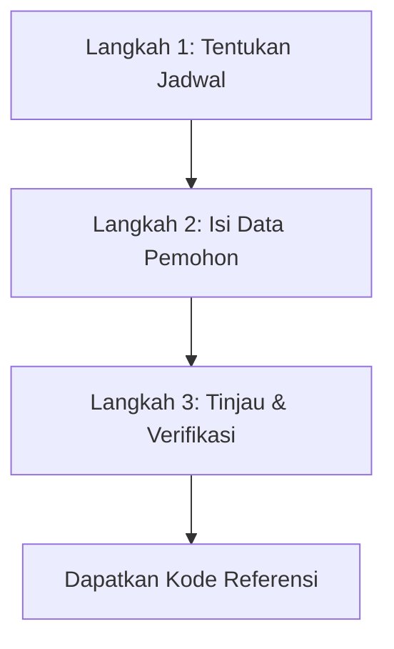
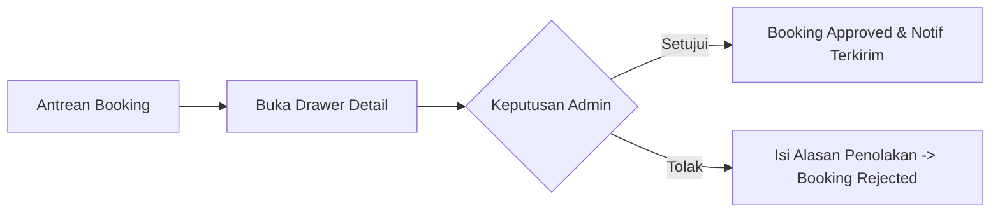

# 👥 Panduan Pengguna (User Guide)

Dokumen ini memuat panduan operasional langkah-demi-langkah bagi **Pemohon Publik** dan **Staf Pengelola (Administrator & Operator)**.

---

## 🙋‍♂️ BAGIAN 1: Panduan Pemohon Publik (Masyarakat / Pegawai)

### 1. Mencari & Memilih Fasilitas
1. Buka halaman utama aplikasi SARPRAS di peramban web Anda.
2. Telusuri katalog sarana dan prasarana yang tersedia. Anda dapat memanfaatkan fitur **Filter Kategori** (Ruang Rapat, Asrama, Auditorium) serta melihat kapasitas dan lokasi gedung.
3. Klik tombol **"Cek Jadwal & Pinjam"** pada kartu fasilitas yang diinginkan.

---

### 2. Mengajukan Permohonan Peminjaman (3-Step Wizard)

1. **Langkah 1 (Jadwal)**:
   - Pilih tanggal mulai dan jam mulai peminjaman.
   - Pilih tanggal selesai dan jam selesai peminjaman.
   - Perhatikan indikator ketersediaan. Jika waktu bertabrakan dengan jadwal lain, sistem akan memberi peringatan bentrok.
   - Klik **"Lanjut ke Data Pemohon"**.
2. **Langkah 2 (Data Pemohon)**:
   - Masukkan **Nama Lengkap**, **Email Aktif**, **Nomor WhatsApp**, **Instansi / Unit Kerja**, **Tujuan Kegiatan**, dan **Jumlah Peserta**.
   - Klik **"Lanjut ke Review"**.
3. **Langkah 3 (Review)**:
   - Periksa kembali ringkasan rincian permohonan Anda.
   - Centang persetujuan pakta integritas dan tata tertib pemakaian fasilitas.
   - Klik tombol **"Kirim Permohonan"**.
4. **Halaman Sukses**:
   - Anda akan mendapatkan **Kode Referensi Pemesanan** unik. Simpan atau salin kode ini.
   - Konfirmasi pengajuan otomatis dikirim ke Email dan WhatsApp Anda.

---

### 3. Melacak Status & Pembatalan Mandiri
1. Kunjungi menu **"Cek Booking"** pada navigasi atas atau buka tautan yang diterima di WhatsApp/Email.
2. Masukkan kode referensi pemesanan Anda.
3. Pada halaman status (`/status/:ref`), Anda dapat melihat perkembangan:
   - 🟡 **Menunggu Tinjauan**: Permohonan sedang dalam antrean verifikasi petugas.
   - 🟢 **Disetujui**: Permohonan disetujui. Anda siap menggunakan fasilitas sesuai jadwal.
   - 🔴 **Ditolak**: Permohonan ditolak (alasan penolakan ditampilkan secara transparan di layar).
4. **Membatalkan Permohonan**:
   - Jika terdapat perubahan agenda, klik tombol **"Batalkan Permohonan"**.
   - Masukkan alasan pembatalan pada kotak dialog yang muncul, lalu klik **"Konfirmasi Pembatalan"**.

---

## 👨‍💼 BAGIAN 2: Panduan Pengelola (Admin & Operator)

### 1. Masuk ke Panel Admin
1. Akses halaman `/login`.
2. Masukkan alamat email staf dan password resmi Anda.
3. Klik tombol **"Masuk ke Dasbor"**.

---

### 2. Dasbor & Tinjauan Antrean Booking (`/admin/bookings`)

1. **KPI Cards & Urgent Widget**:
   - Menampilkan ringkasan total booking pending, permohonan disetujui, dan permohonan yang mendesak (kegiatan < 24 jam ke depan).
2. **Tinjau Permohonan**:
   - Klik pada baris permohonan untuk membuka **Review Drawer**.
   - Periksa kesesuaian dokumen, jumlah peserta, dan waktu pemakaian.
3. **Persetujuan**:
   - Klik tombol hijau **"Setujui Permohonan"** untuk mengunci jadwal fasilitas dan mengirim surat konfirmasi ke pemohon.
4. **Penolakan**:
   - Klik tombol merah **"Tolak Permohonan"**.
   - Tuliskan alasan penolakan pada modal yang muncul (misal: *Ruangan sedang dalam perbaikan AC*).
   - Klik **"Kirim Penolakan"**. Notifikasi alasan penolakan otomatis terkirim ke pemohon.

---

### 3. Kalender Fasilitas Interaktif (`/admin/calendar`)
- Melihat visualisasi pemakaian seluruh fasilitas dalam tampilan bulan/minggu.
- Klik pada blok kegiatan untuk melihat ringkasan peminjam dan status permohonan.

---

### 4. Manajemen Aset & Pengguna
- **Kelola Fasilitas (`/admin/assets`)**: Tambah ruang rapat baru, sesuaikan kapasitas maksimum, ubah status operasional aset (*active/inactive/archived*).
- **Kelola Pengguna (`/admin/users`)**: Khusus Super Admin untuk mendaftarkan operator baru, menetapkan peran (*Role*), dan me-reset password staf.
- **Audit Log (`/admin/audit`)**: Memantau rekam jejak setiap mutasi data, waktu perubahan, dan aktor yang melakukan tindakan.
